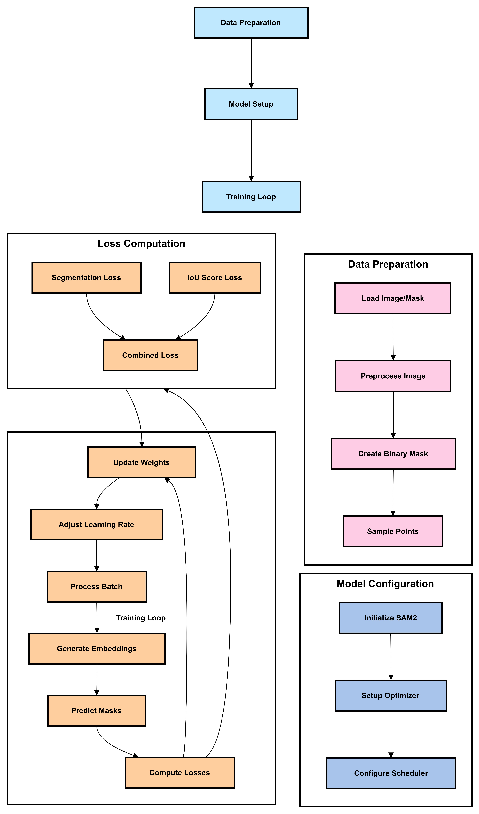

# Chest CT Segmentation with SAM2 🫁

[](https://opensource.org/licenses/MIT)
[](https://www.python.org/downloads/)
[](https://github.com/facebookresearch/segment-anything-2)

Fine-tuning Segment Anything Model 2 (SAM2) for chest CT scan segmentation tasks. This project provides tools and instructions for training SAM2 on medical imaging data.

## 📋 Table of Contents

- [Requirements](#-requirements)
- [Installation](#-installation)
- [Dataset](#-dataset)
- [Usage](#-usage)
- [Project Structure](#-project-structure)
- [Contributing](#-contributing)
- [License](#-license)

## 🔧 Requirements

- Python 3.8+
- CUDA-capable GPU (recommended)
- Git
- Jupyter Notebook
- Required Python packages (installed automatically)

## 🚀 Installation

1. Clone this repository:
```bash
git clone https://github.com/yourusername/FineTune_SAM2.git
cd FineTune_SAM2
```

2. Run the installation script:
```bash
chmod +x installations.sh
./installations.sh
```

This script will:
- Clone and install SAM2
- Download necessary model checkpoints
- Set up the training environment
- Install required dependencies

## 📊 Dataset

1. Download the following files from [Kaggle](https://www.kaggle.com/datasets/polomarco/chest-ct-segmentation/data):
   - `images.zip`
   - `masks.zip`
   - `train.csv.zip`

2. Place the downloaded files in the `Sam2-Training-Data` directory:
```plaintext
Sam2-Training-Data/
├── images.zip
├── masks.zip
└── train.csv.zip
```

The installation script will automatically extract these files to the correct locations.

## 💻 Usage

1. Navigate to the finetuning directory:
```bash
cd segment-anything-2/src_finetuning
```

2. Open and run the finetuning notebook:
```bash
jupyter notebook finetune_sam2.ipynb
```

3. Follow the instructions in the notebook to:
   - Load and preprocess the data
   - Configure training parameters
   - Train the model
   - Evaluate results


## 🔧 Finetuning Schema


## 📁 Project Structure

```plaintext
.
├── installations.sh
├── Sam2-Training-Data/
│   ├── images.zip
│   ├── masks.zip
│   └── train.csv.zip
└── segment-anything-2/
    ├── assets/
    │   └── Sam2-Train-Data/
    ├── checkpoints/
    └── src_finetuning/
        └── finetune_sam2.ipynb
```

## 🤝 Contributing

Contributions are welcome! Please feel free to submit a Pull Request. For major changes, please open an issue first to discuss what you would like to change.

## 📄 License

This project is licensed under the MIT License - see the [LICENSE](LICENSE) file for details.

## 🙏 Acknowledgments

- [Facebook Research](https://github.com/facebookresearch/segment-anything-2) for SAM2
- [Chest CT Segmentation Dataset](https://www.kaggle.com/datasets/polomarco/chest-ct-segmentation/data) from Kaggle

---
Created with ❤️ for medical image analysis